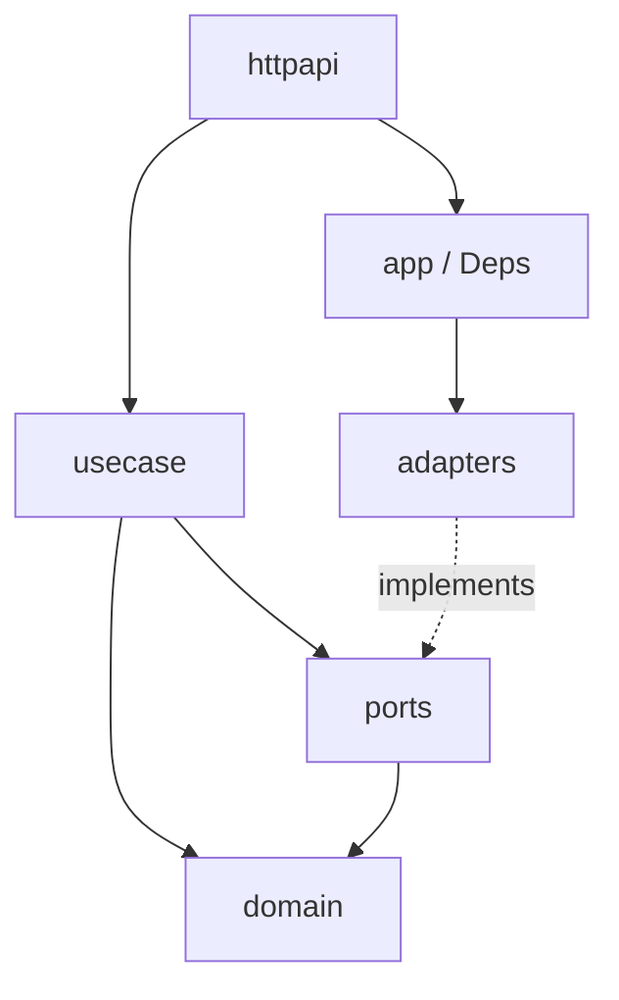

# Lake — Go backend architecture

Lake is the Go reimplementation target for the Python Flask backend under `backend/`. The layout follows **hexagonal (ports & adapters)**, **clean boundaries**, and **SOLID** so new features plug in without rewriting callers.

## Mapping from Python backend

| Python (`backend/app`) | Go (`lake/internal`) | Role |
|------------------------|----------------------|------|
| `api/graph.py`, `simulation.py`, `report.py` | `httpapi` | HTTP transport only: decode request, call port, encode response |
| `services/*` | `usecase` (per bounded context) | Application rules orchestrating ports (add packages as you port logic) |
| `storage/*`, file I/O, subprocess | `adapters` | Infrastructure: Neo4j, LLM HTTP, uploads, simulation IPC |
| `models/project.py`, `task.py` | `domain` | Entities, value objects, domain errors (no imports from adapters) |
| `config.py` | `config` | Load and validate environment |
| `create_app` + extensions | `app` | Composition root: construct adapters, wire handlers, shared `Deps` |

## Layer rules

1. **domain** — Pure types and errors. No `database/sql`, no `net/http`, no third-party SDKs.
2. **ports** — Small interfaces consumed by `usecase` or (temporarily) by `httpapi` while use cases are thin. *Dependency inversion:* inner layers define interfaces; outer layers implement them.
3. **usecase** — One package per capability area (`graph`, `simulation`, `report`) when logic grows. Handlers delegate here; tests mock ports.
4. **adapters** — Implement `ports`. May import Neo4j driver, OpenAI-compatible clients, `os`, etc.
5. **httpapi** — Depends on `ports` (or use case structs that embed ports). Never import concrete adapters.
6. **app** — The only place that imports `adapters` and passes implementations into HTTP or use cases.

## DRY guidelines

- **JSON envelope:** Use `httpapi` helpers so every route returns the same `{ "success", "data" | "error" }` shape as the Flask API.
- **Path prefixes:** `/api/graph`, `/api/simulation`, `/api/report` mirror existing blueprints; frontends can switch host without path churn.
- **Config keys:** Align with `.env` / `.env.example` at repo root (`LLM_*`, `NEO4J_*`, etc.).

## SOLID (how it shows up)

- **S** — Handlers do I/O only; growing logic moves to `usecase` with focused types.
- **O** — New storage or LLM vendor = new adapter struct implementing the same port; no handler edits beyond wiring.
- **L** — Adapters honor port contracts; tests use fakes/in-memory implementations.
- **I** — Interfaces are split by caller need (`ProjectStore`, `TaskStore`, `GraphBuilder`, …) rather than one “god” interface.
- **D** — `usecase` and `httpapi` depend on abstractions (`ports`); `app` supplies concretes.

**Go note:** A single concrete type cannot implement two interfaces that both require the same method name with different signatures. Project vs task persistence therefore use explicit names (`GetProject` / `GetTask`, `ListProjects` / `ListTasks`, …) instead of overloading `Get` / `List`.

## Incremental porting order (suggested)

1. **Config + health + JSON envelope** (done in scaffold).
2. **Project + task persistence** — `internal/adapters/projectstore` and `internal/adapters/taskstore` (see above routes).
3. **Ontology generate** — `internal/usecase/ontology` (embedded `system_prompt.txt` from Python), `internal/adapters/openai` (chat completions + JSON), `internal/adapters/fileparser` + `textproc`. Wired: `POST /api/graph/ontology/generate`.
4. **Graph build** — `internal/adapters/neo4j` (`GraphStore`: schema, `create_graph`, `set_ontology`, `add_text` / batches, `get_graph_data`, `delete_graph`), `internal/usecase/ner`, `internal/adapters/ollama` embeddings; HTTP `POST /api/graph/build`, `GET/DELETE` graph data/delete.
5. **Simulation** — `usecase/simulation` orchestrates `ports.SimulationRepository` (`adapters/simulationfs`), `EntityReader` (Neo4j), `ProfileBuilder` + `SimulationConfigBuilder` (`adapters/simulationprep`, LLM), and `ports.SimulationRuntime` (`adapters/simrunner`: Python `run_parallel_simulation.py`, `run_state.json`, jsonl tail, filesystem IPC). HTTP: `/api/simulation/*` (entities, create/prepare/start/stop, profiles/config, run-status, actions, posts, interview batch, env-status). If `LAKE_BACKEND_ROOT` / scripts are missing, runtime falls back to `simrunner.Disabled` (prepare still works; start returns an error).
6. **Report** — `ReportAgent`, `GraphToolsService`, file-backed `ReportManager`.

## Module entry

- `cmd/lake/main.go` — Load config, build `app`, run HTTP server.

## Testing strategy

- Unit-test `usecase` with fake `ports` implementations.
- Contract or integration tests for `adapters/neo4j` against a real Neo4j when CI allows.
